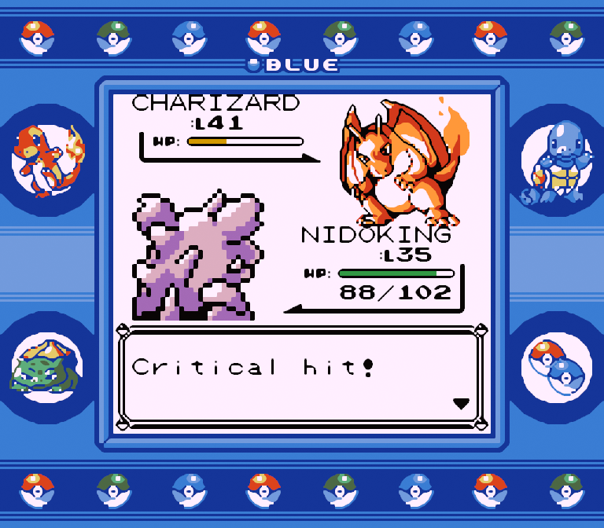
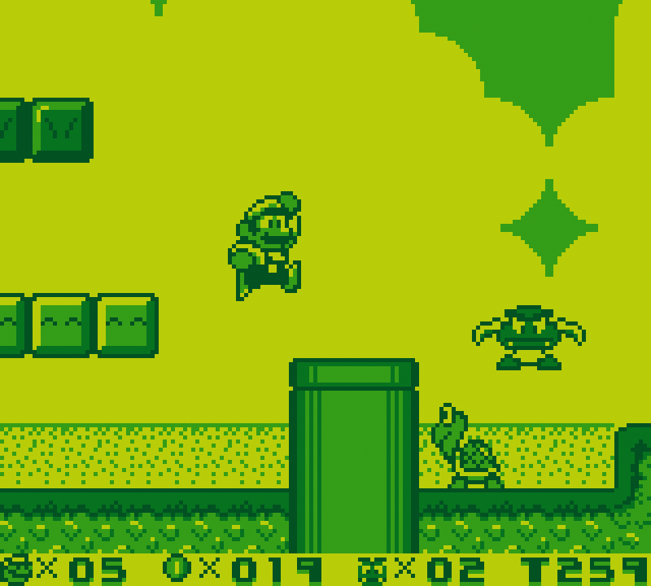

<figcaption class="game-title">Pokémon Gold</figcaption>
<figcaption class="platform">Game Boy Color</figcaption>

<figcaption class="game-title">Kirby's Dream Land 2</figcaption>
<figcaption class="platform">Game Boy</figcaption>

<figcaption class="game-title">Mario's Picross</figcaption>
<figcaption class="platform">Super Game Boy</figcaption>

<figcaption class="game-title">Daffy Duck – Fowl Play</figcaption>
<figcaption class="platform">Game Boy Color</figcaption>

<figcaption class="game-title">Prehistorik Man</figcaption>
<figcaption class="platform">Game Boy</figcaption>

<figcaption class="game-title">Pokémon Blue</figcaption>
<figcaption class="platform">Super Game Boy</figcaption>

<figcaption class="game-title">Link's Awakening DX</figcaption>
<figcaption class="platform">Game Boy Color</figcaption>

<figcaption class="game-title">Super Mario Land 2</figcaption>
<figcaption class="platform">Game Boy</figcaption>

<figcaption class="game-title">Donkey Kong</figcaption>
<figcaption class="platform">Super Game Boy</figcaption>

SameBoy is a user friendly, powerful and [open source](https://github.com/LIJI32/SameBoy) Game Boy, Game Boy Color and Super Game Boy emulator for macOS, Windows and Unix-like platforms. SameBoy is extremely [accurate](/features/#accuracy) and includes a wide range of both [powerful debugging features](/features/#debugging) and [user-facing features](/features/#user-interface), making it ideal for both casual players and developers. Of course, SameBoy also has [every feature](/features/) one would expect from an emulator – from save states to [scaling filters](/scaling/).



  <a id="download-link" class="download-link" href="{{ post.url | relative_url }}">Download {{ post.title | escape }}</a>
  
<a id="appstore-link" href="https://apps.apple.com/us/app/sameboy/id6496971295">SameBoy for iOS is available on the App Store</a>

  
  
  
  

